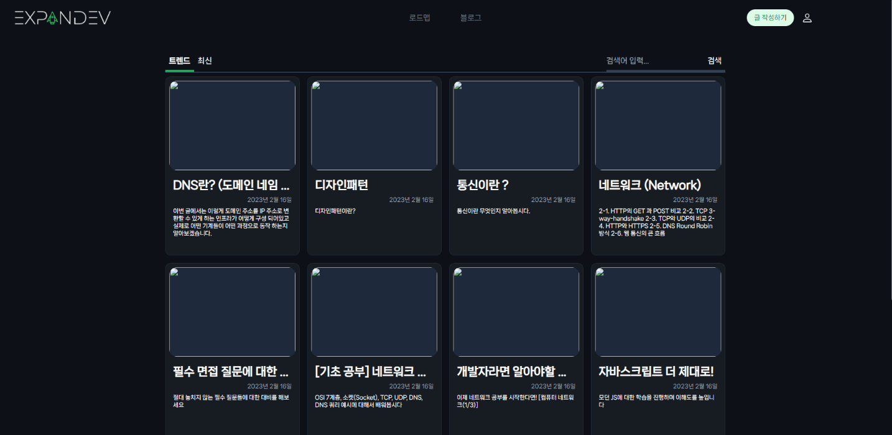
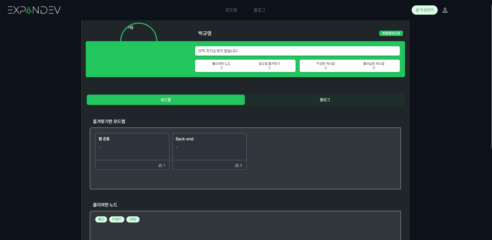
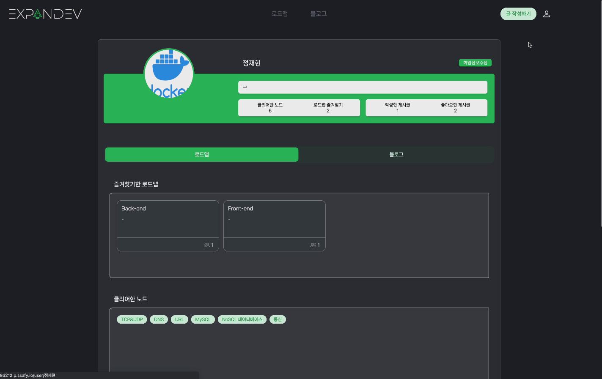
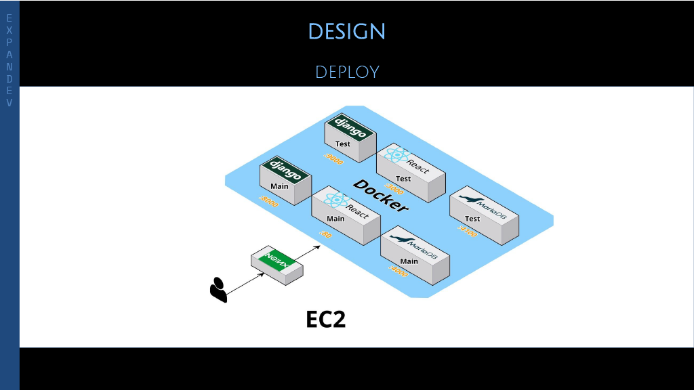
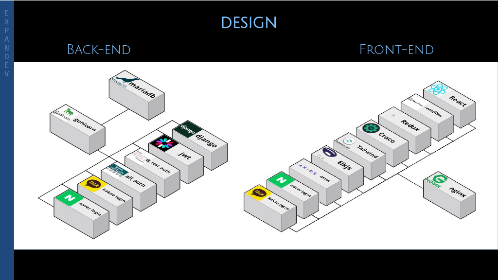

<p align="center">
  <a href="" rel="noopener">
 </a>
</p>

<h3 align="center">Expandev</h3>

<div align="center">

  []() 
  
  
  [](https://github.com/cloudsoswift/Expandev/issues)
  [](https://github.com/cloudsoswift/Expandev/pulls)

</div>

---

<p align="center"> 개발자들을 위한 로드맵 및 기술 블로그 서비스
    <br> 
</p>

## 📝 목차 (Table of Contents)
- [About](#about)
- [Feature](#feature)
- [Deployment](#deployment)
- [Built Using](#built_using)
- [Authors](#authors)
- [Acknowledgments](#acknowledgement)
- [Rules](#rules)

## 🧐 프로젝트에 대하여 (About) <a name = "about"></a>
삼성청년SW아카데미 8기 **공통 프로젝트**로 진행한 프로젝트입니다. 
**Expandev**는 “*혼자 개발 공부를 하고있는 **개발 초보 및 입문자**들에게 **개발 공부의 길을 제시**해주는 서비스가 있으면 어떨까?*” 라는 아이디어에서 시작되었습니다. 
프론트엔드, 백엔드등 사용자가 원하는 개발 직군을 선택하면 해당 **개발 직군**에서 어떤 *도메인 지식*과 *기술 스택*을 알고 있어야 하는지를 **로드맵 형태로 표시**해줍니다.  
로드맵의 각 노드들에 대해 상세 설명, 관련 블로그 글, 한줄평을 확인할 수 있습니다. 또한 각 도메인 지식, 기술 스택에 대해 **기술 블로그에 글을 작성**할 수 있습니다.

## 🎈기능 (Feature) <a name="feature"></a>
기능은 다음과 같습니다.
### 로드맵 탐색
트랙 최상위 주제(상황 별) 노드 > 하위 주제(상황 세부) 노드 형태로 로드맵이 구성되어 있습니다.
- 왼쪽 메뉴바 상위 트랙 목록이 보입니다 즐겨찾기 버튼으로 로드맵 즐겨찾기 할 수 있습니다. (로그인 필요)
- 왼쪽 메뉴바에서 상위 트랙을 선택하면 하위 메뉴가 나열 됩니다 .

- 하위 메뉴 클릭시 우주 내의 해당 위치 별 로 이동합니다 .

- 하위 메뉴 클릭시 세부 노드가 열리고 세부 노드 클릭시 노드 정보 모달 페이지가 열립니다. 이는 우주 내의 세부노드 별을 클릭해도 동일합니다.

#### 노드 정보 모달 페이지

- 추천 컨텐츠 : 추천 강의 유튜브 링크 이동
- 블로그 : 해당 노드를 태그로 가지고 있는 블로그 글 More : 해당 노 드를 태그로 가지고
있는 게시글 조회
- 인터뷰 : 전문가 현직자 인터뷰
- WHAT : 노드에 대한 간략 정보
- WHY : 공부해야 하는 이유 어떤 것을 공부해야 하는지
- REVIEW : 회원들이 작성한 리뷰 리뷰들의 평균 중요도 난이도
- POST : 해당 노드를 태그로 가 진 블로그 글 작성 페이지로 이동
### 블로그
- 트렌드(게시글 조회수 순), 최신(게시글 최신 순) 정렬이 가능합니다.

- 게시글 작성 (로그인 필요)
 글 작성시 markdown 형식으로 미리보기와 함께 작성 페이지 제공되며, 게시물 별로 태그는 10 개까지 가능합니다.

- 댓글, 대댓글 작성, 게시글/댓글 좋아요 (로그인 필요)
- 검색: 제목으로 게시글을 검색합니다.
- 태그 클릭시 태그를 가지고 있는 게시글이 조회됩니다.

### 로그인 / 회원가입
- 소셜 로그인: 카카오, 네이버

- 기본 로그인, 회원가입
### 마이페이지

- 클리어한 노드와 즐겨찾기한 로드맵, 작성한 노드 리뷰, 좋아요한 리뷰를 확인할 수 있다.
- 클리어한 노드 클릭시 해당 노드의 노드정보 모달페이지로 이동한다.
- 작성한 게시글, 댓글, 좋아요 정보를 확인할 수 있다.

## 🚀 배포 (Deployment) <a name = "deployment"></a>
### 사용한 JVM, 웹서버 WAS 제품 등의 종류와 설정값 버전 (IDE 버전 포함)
- Docker version : 20.10.23, build 7155243
- Docker images[BE] : dreamjh/morehae:2.0.0
- Docker images[FE] : nginx:stable-alpine
- Nginx : stable alpine
- Django : 3.2.12
- mariaDB : latest
- Jenkins : lts
- IDE: VSCODE 1.74.2
- Node.js : 18.13.0
### 특이사항
- Docker image 중 `dreamjh/morehae:2.0.0` 의 경우 `Ubuntu 20.0.4` 의 이미지를 바탕으로 **커스텀**한 환경이므로 *추후 사용 불가능할 수 있습니다.*
### 시스템 구조
서비스의 Port별 구조는 아래와 같습니다.

- `:80` - Main branch의 React로 작성된 코드가 Build되어 배포되는 포트입니다.
- `:8000` - Main branch의 Django로 작성된 서버 코드가 실행되는 포트 입니다.
- `:4000` - Main branch의 Django Backend에서 사용중인 Main DB와 연결되는 포트 입니다.
- `:9000` - 'dev' branch의 Django로 작성된 서버 코드가 실행되는 포트 입니다.
- `:3000` - 'dev' branch의 React로 작성된 코드가 Build되어 배포되는 포트입니다.
- `:4100` - 'dev' branch의 Django Backend에서 사용중인 Test용 DB와 연결되는 포트입니다.

## ⛏️ 기술 스택 (Built Using) <a name = "built_using"></a>



<br/>


- FE
  - [NodeJs](https://nodejs.org/en/) - Frontend Environment
  - [React](https://react.dev/) - Frontend Framework
    - 컴포넌트 단위 개발을 통한 협업, 코드 재사용
  - [Redux](https://ko.redux.js.org/) - Frontend Library for Global State Management
    - 효율적인 전역상태 관리
  - [tailwindcss](https://tailwindcss.com/) - Frontend CSS Framework based on 'Utility-First'
    - 미리 세팅된 유틸리티 클래스를 활용해 CSS 스타일링하므로써 HTML 태그의 클래스에 CSS 속성이 직관적으로 드러남
  - [reactflow](https://reactflow.dev/) - Frontend Library for Visualize Roadmap
    - Graph 형태를 효율적으로 표현 가능
  - [Elkjs](https://github.com/kieler/elkjs) - Frontend Library for Calculate Graph Node Position
    - Graph 형태와 각 그래프를 구성하는 노드들의 위치 계산
  - [axios](https://axios-http.com/kr/docs/intro) - Frontend Library for Communication with Django APIs
- BE
  - [Django](https://www.djangoproject.com/) - Server Framework
    - 낮은 학습 곡선. 보안 기능을 기본 제공.
  - [MariaDB](https://mariadb.org/) - Database
    - 동일 하드웨어 사양으로 MySQL보다 향상된 성능
  - [Django Rest Auth](https://github.com/iMerica/dj-rest-auth) - Django Library about User Authentication
  - [Django All Auth](https://www.intenct.nl/projects/django-allauth/) - Django Library about User Authentication for `django-rest-framework`
  - [gunicorn](https://gunicorn.org/) - Python WSGI HTTP Server

## ✍️ 팀원 (Authors) <a name = "authors"></a>
- [정재현](https://github.com/JAY-Winter) - 팀장. 백엔드 개발. 계정 관련 API 및 소셜 로그인 담당.
- [오지나](https://github.com/jina5) - 백엔드 개발. 블로그 관련 API 담당.
- [홍종혁](https://github.com/dreamjh1111) - 백엔드 개발. 인프라 구축(Docker, Jenkins를 이용한 CI/CD). 로드맵 관련 API 담당.
- [이용훈](https://github.com/akatcn) - 프론트엔드 개발. 메인 페이지, 로그인, 회원가입 및 블로그 글 검색, 댓글 담당.
- [박규영](https://github.com/cloudsoswift) - 프론트엔드 개발. 로드맵 시각화 및 블로그 글 작성, 읽기 페이지 담당. 공통 사용 라이브러리(axios, Redux) 모듈화 담당.
- [박소현](https://github.com/foresec) - 프론트엔드 개발. 로드맵 모달 및 마이 페이지 담당.


## 🎉 도움 (Acknowledgements) <a name = "acknowledgement"></a>
- Inspiration
  - [roadmap.sh](https://roadmap.sh/) - 아이디어의 영감과 개선점을 제공해준 서비스입니다.

## 📑 협업 규칙(Rules) <a name = "rules"></a>
---
### Commit Type

- feat : 새로운 기능 추가, 기존의 기능을 요구 사항에 맞추어 수정
- fix : 기능에 대한 버그 수정
- build : 빌드 관련 수정
- chore : 패키지 매니저 수정, 그 외 기타 수정 ex) .gitignore
- ci : CI 관련 설정 수정
- docs : 문서(주석) 수정
- style : 코드 스타일, 포맷팅에 대한 수정
- refactor : 기능의 변화가 아닌 코드 리팩터링 ex) 변수 이름 변경
- test : 테스트 코드 추가/수정
- release : 버전 릴리즈

## REST API

### URI 

#### 1. 마지막에 `/` 를포함하지 않는다.

**Bad**

```
http://api.test.com/users/
```

**Good**

```
http://api.test.com/users
```

#### 2. _(underbar) 대신 -(dash)를 사용한다.

-(dash)의 사용도 최소한으로 설계한다. 정확한 의미나 표현을 위해 단어의 결합이 불가피한 경우 반드시 -(dash) 사용한다.

**Bad**

```
http://api.test.com/users/post_commnets
```

**Good**

```
http://api.test.com/users/post-commnets
```

#### 3. 소문자를 사용한다.

**Bad**

```
http://api.test.com/users/postCommnets
```

**Good**

```
http://api.test.com/users/post-commnets
```

#### 4. 행위(method)는 URI 에 포함하지 않는다.

**Bad**

```
POST http://api.test.com/users/1/delete-post/1
```

**Good**

```
DELETE http://api.test.com/users/1/posts/1
```

#### 5. 컨트롤 자원을 의미하는 URI 는 예외적으로 동사를 허용한다.

함수처럼, 컨트롤 리소스를 나타내는 URL은 동작을 포함하는 이름을 짓는다.

**Bad**

```
http://api.test.com/posts/duplicating
```

**Good**

```
http://api.test.com/posts/duplicate
```

### Use HTTP status

#### 1. 의미에 맞는 HTTP status 를 리턴한다.

**Bad**

```http
HTTP/1.1 200 OK

{
    "result" : false
    "status" : 400
}
```

- status는 `200`으로 성공인데 body 내용엔 실패에 관한 내용을 리턴하고 있다.
  - 모든 응답을 `200`으로 처리하고 body 내용으로 `성공|실패`를 판단하는 구조에서 사용된다. 잘못된 설계다.

**Good**

```http
HTTP/1.1 400 Bad Request

{
    "msg" : "check your parameter"
}
```

#### 2. HTTP status 만으로 상태 에러를 나타낸다.

세부 에러 사항은 응답 객체에 표시하거나, 해당 에러를 확인할 수 있는 link를 표시한다.

**http 상태 코드를 응답 객체에 중복으로 표시할 필요 없다.**

**Bad**

```http
HTTP/1.1 404 Not Found

{
    "code" : 404,
    "error_code": -765
}
```

**Good**

```http
HTTP/1.1 404 Not Found

{
    "code" : -765,
    "more_info" : "https://api.test.com/errors/-765"
}
```

### HTTP status code

#### 2XX Success

- 200 OK
- 201 Created
- 202  Accepted
- 204 No Content

#### 4XX Client errors

- 400 Bad Request

- 401 Unauthorized
- 403 Forbidden
- 404 Not Found
- 405 Method Not Allowd
- 409 Conflict
- 429 Too many Requests

#### 5XX Server errors

### `5XX` 에러는 사용자에게 나타내지 않는다.